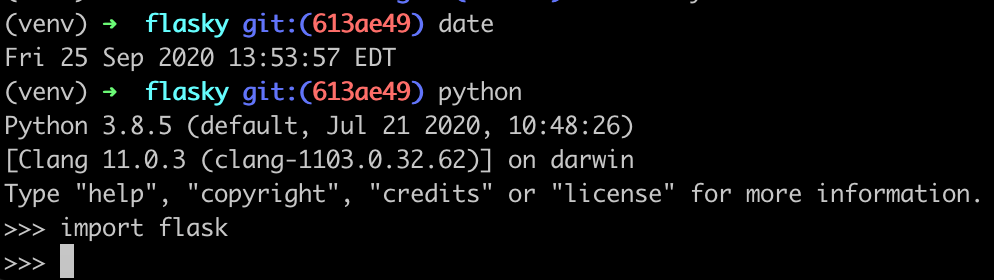
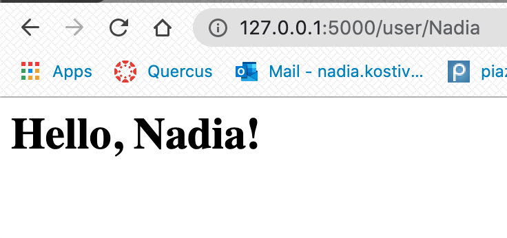

***ECE444 Lab 2***

*Activity 1:*

*Activity 2:*

Nadia Kostiv

this repo is a clone of
https://github.com/miguelgrinberg/flasky

Activity 3:

Flask uses contexts to temporarily make certain objects (eg. requests or apps) globally accessible to a thread without interfering with other threads. The context will be available globally on one thread, but will reference a different, equally relevant object in another thread.

